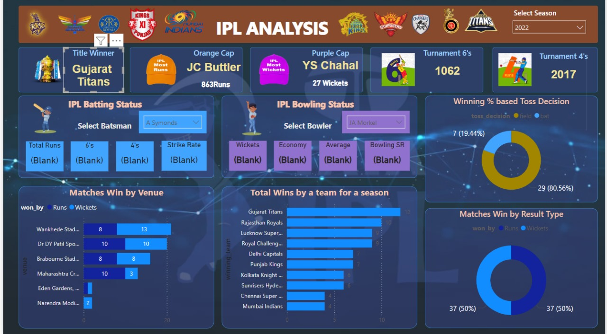

# IPL Analysis Dashboard - Power BI
This project presents a detailed analysis of the 2022 IPL season using Power BI. The dashboard is designed to provide key insights into the tournament, such as team performance, player statistics, and venue-specific outcomes. The interactive elements allow users to explore various aspects of the IPL season.
### Output PowerBI Interface

## Key Features
### 1. Season Overview
- **Title Winner**: Displays the IPL 2022 winner - Gujarat Titans.
- **Orange Cap**: Top run-scorer - Jos Buttler (863 runs).
- **Purple Cap**: Leading wicket-taker - Yuzvendra Chahal (27 wickets).
- **Tournament 6's and 4's**: Overview of total sixes (1062) and boundaries (2017) in the tournament.
### 2. Batting and Bowling Statistics
**IPL Batting Status:**
Select any batsman from a dropdown (e.g., A. Symonds) to view their performance metrics like:
-Total Runs
- 6's
- 4's
- Strike Rate
**IPL Bowling Status:**
Select any bowler from a dropdown (e.g., JA Morkel) to view bowling performance like:
- Wickets taken
- Economy Rate
- Bowling Average
- Bowling Strike Rate

Here's a sample README file for your Power BI IPL analysis project:

IPL Analysis Dashboard - Power BI
This project presents a detailed analysis of the 2022 IPL season using Power BI. The dashboard is designed to provide key insights into the tournament, such as team performance, player statistics, and venue-specific outcomes. The interactive elements allow users to explore various aspects of the IPL season.

Key Features
1. Season Overview
Title Winner: Displays the IPL 2022 winner - Gujarat Titans.
Orange Cap: Top run-scorer - Jos Buttler (863 runs).
Purple Cap: Leading wicket-taker - Yuzvendra Chahal (27 wickets).
Tournament 6's and 4's: Overview of total sixes (1062) and boundaries (2017) in the tournament.
2. Batting and Bowling Statistics
IPL Batting Status:
Select any batsman from a dropdown (e.g., A. Symonds) to view their performance metrics like:
Total Runs
6's
4's
Strike Rate
IPL Bowling Status:
Select any bowler from a dropdown (e.g., JA Morkel) to view bowling performance like:
Wickets taken
Economy Rate
Bowling Average
Bowling Strike Rate
### 3. Venue Analysis
Matches Won by Venue: Detailed comparison of wins at different venues, such as Wankhede, Dr. DY Patil, and Eden Gardens, based on whether matches were won by runs or wickets.
### 4. Team Performance
Total Wins by a Team for a Season:
Visual representation of wins for each IPL team, with Gujarat Titans leading with 12 wins.
Insights into how teams like Rajasthan Royals, Lucknow Super Giants, and others performed.
### 5. Toss Decision Impact
**Winning % Based on Toss Decision:**
A pie chart showing how often teams that chose to field or bat after winning the toss ended up winning. Fielding first after winning the toss resulted in an 80.56% win rate.
### 6. Match Result Analysis
**Matches Win by Result Type:**
A 50-50 split for matches won by runs and wickets, showing the close competition throughout the season.
